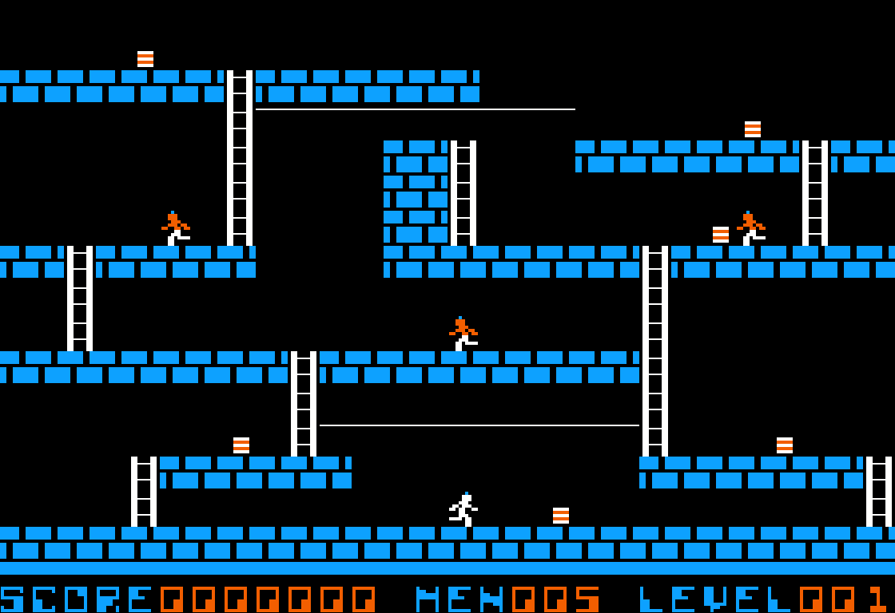

**loderunner-ng** is a classic Lode Runner game remake heavily based on [LodeRunner_TotalRecall](https://github.com/SimonHung/LodeRunner_TotalRecall) implementation by Simon Hung.\
Practically all sprites are taken from [LodeRunner_TotalRecall](https://github.com/SimonHung/LodeRunner_TotalRecall) project. Code is mostly written from scratch using [LodeRunner_TotalRecall](https://github.com/SimonHung/LodeRunner_TotalRecall) as a reference and documentation. Another helpful source of implementation details was used is [Championship Lode Runner: Guard psychology and analysis of the C code](https://datadrivengamer.blogspot.com/2023/01/championship-lode-runner-guard.html) article.

### Screenshots


### Build and run
The app can be built using `cmake` command.
```shell
$ cmake .
$ cmake --build .
$ ./loderunner-ng
```
Application also supports some useful command-line options.
* `-f` -- run in fullscreen mode
* `-l N` -- start playing directly from level `N` (1..150)
* `-m` -- mute sound
* `-V N` -- set sound volume to `N` percents

### Keys
* `Left` -- move left
* `Up` -- move up
* `Right` -- move right
* `Down` -- move down
* `X` -- dig hole right to the runner
* `Z` -- dig hole right to the runner
* `P` -- pause
* `Escape`/`Q` -- quit
* `Enter` -- skip keyhole animation

### Copying
The program's source code (excluding textures and sounds), is released under the GNU General Public License version 3 or later, which is distributed in the COPYING file. Textures and sound belongs to [LodeRunner_TotalRecall](https://github.com/SimonHung/LodeRunner_TotalRecall) project by Simon Hung.
